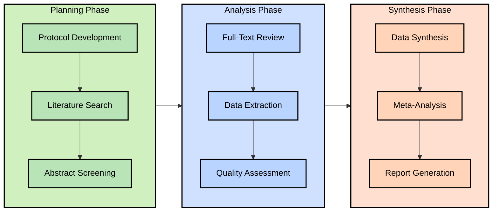

# Systematic Review Assistant

## Open Questions
- [ ] MVP priority: screening, extraction, or another step? (what do we build first)
- [ ] Focus scope: Bell's Palsy only or different ENT condition?
- [ ] Most appropriate LLM for medical domain tasks?
- [ ] Optimal automation vs. human oversight balance? Specific researcher pain points in systematic reviews?
- [ ] Available validation benchmarks from existing reviews?
- [ ] Success metrics for MVP evaluation?
- [ ] Strategies for addressing LLM hallucinations in medical contexts? (Auditability)

## Action Items
To be tackled after scope definition.
- [ ] Next meeting with Dr. Song to refine scope
- [ ] Review landscape of existing tools for systematic review
- [ ] Review best practices for systematic review (Cochrane? Other?)
- [ ] Sketch technical specifications

## Background
Systematic reviews are notorious time-sinks. Researchers frequently spend months manually parsing literature - a process ripe for intelligent assistance. Our goal: build an AI tool that meaningfully reduces workload without compromising research standards.

## Validation Strategy

We'll validate by replicating a published systematic review:
- Compare results, time investment, and accuracy
- Document discrepancies and system improvements
- Measure against defined success metrics (time reduction, accuracy)

## Systematic Review Process

### Key Process Steps
1. **Protocol Development**: PICO framework, inclusion/exclusion criteria, search strategy
2. **Literature Search**: Database queries, citation export, duplicate removal
3. **Abstract Screening**: Title/abstract review against criteria, multiple reviewers
4. **Full-Text Review**: Detailed assessment, reference list checking
5. **Data Extraction**: Study characteristics, methods, outcomes, statistical data
6. **Quality Assessment**: Risk of bias evaluation using validated tools
7. **Data Synthesis**: Organization and summarization of findings
8. **Meta-Analysis**: Statistical combination of results, heterogeneity assessment
9. **Report Generation**: PRISMA-compliant documentation, findings summary

## Technical Approach

We'll implement a hybrid approach combining AI capabilities with human oversight:

1. **Key Requirements**
   - Auditability: Traceable decisions with source text support
   - Human verification: Review interface with override capabilities
   - Integration: Compatibility with tools researchers currently use

2. **MVP Options**

   | Option | Focus | Priority |
   |--------|-------|----------|
   | Abstract Screening | Automate screening of hundreds/thousands of abstracts | High |
   | Data Extraction | Extract structured data from full-text articles | High |
   | Protocol Development | Guide researchers in designing robust protocols | Medium |
