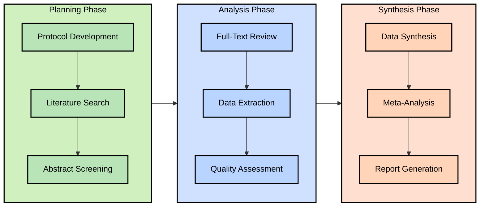

# Systematic Review Assistant: Project Definition

## Action Items
- [ ] Gather feedback from ENT specialists on the proposed Bell's Palsy systematic review focus
- [ ] Review existing systematic review tools to identify gaps our solution should address
- [ ] Consult with UCSF librarians about optimal database selection for ENT literature
- [ ] Identify potential collaborators with systematic review expertise for advisory input
- [ ] Schedule meeting with Dr. Song to refine project scope and priorities
- [ ] Research IRB requirements for using patient data in systematic review validation
- [ ] Outline technical specification document for developer team review
- [ ] Identify potential funding sources for project development

## Open Questions
- [ ] Which systematic review step should we prioritize for the MVP (screening, extraction, etc.)?
- [ ] Should we focus exclusively on Bell's Palsy or expand to other ENT conditions?
- [ ] Which LLM model is most appropriate for medical domain tasks?
- [ ] What is the appropriate balance between automation and human oversight?
- [ ] What specific pain points do researchers face in the systematic review process?
- [ ] Are there existing systematic reviews we could use as validation benchmarks?
- [ ] What metrics should we use to evaluate the success of our MVP?
- [ ] How will we address potential LLM hallucinations in medical contexts?

## Project Overview

This project aims to develop an LLM-powered assistant system for conducting systematic reviews in medical research, with an initial focus on ENT (Ear, Nose, and Throat) studies, particularly related to Bell's Palsy. The system will streamline the systematic review process while maintaining rigorous academic standards through human oversight and verification.

## Systematic Review Process

A systematic review follows a structured methodology to comprehensively analyze all available research on a specific topic. Below is the detailed process we will address:

### 1. Protocol Development
- Define research question using PICO framework (Population, Intervention, Comparison, Outcome)
- Establish inclusion/exclusion criteria
- Determine search strategy and databases
- Define data extraction methodology
- Register protocol (e.g., PROSPERO)

### 2. Literature Search
- Execute search queries across multiple databases (PubMed, Embase, Cochrane, etc.)
- Document search strategy and results
- Export citations to reference management software
- Remove duplicates

### 3. Abstract Screening
- Screen titles and abstracts against inclusion/exclusion criteria
- Require multiple reviewers for each abstract
- Resolve disagreements through consensus or third reviewer
- Document reasons for exclusion

### 4. Full-Text Review
- Retrieve full-text articles for included abstracts
- Apply inclusion/exclusion criteria to full texts
- Document reasons for exclusion
- Identify additional studies through reference lists

### 5. Data Extraction
- Extract predefined data points from included studies
- Use standardized extraction forms
- Extract study characteristics, methods, participants, interventions, outcomes
- Extract statistical data for meta-analysis

### 6. Quality Assessment
- Evaluate risk of bias using validated tools (e.g., Cochrane RoB 2, ROBINS-I)
- Assess methodological quality
- Document assessment for each included study

### 7. Data Synthesis
- Organize and summarize extracted data
- Identify patterns across studies
- Prepare data for meta-analysis if applicable

### 8. Meta-Analysis
- Perform statistical analysis to combine results across studies
- Calculate effect sizes, confidence intervals
- Assess heterogeneity
- Conduct subgroup analyses as specified in protocol

### 9. Report Generation
- Write comprehensive report following PRISMA guidelines
- Create PRISMA flow diagram
- Summarize findings and implications
- Discuss limitations and future directions

## Potential Approaches to Systematic Review Assistance

There are several potential approaches to developing tools that assist with systematic reviews:

### AI-Assisted Approach
- Uses LLMs and other AI technologies to automate or semi-automate various steps
- Requires significant human verification but reduces manual effort
- Can handle unstructured text and extract meaningful information
- Potential concerns about hallucinations and accuracy in medical contexts

### Rules-Based Approach
- Uses predefined rules and patterns to identify relevant information
- More predictable behavior but less flexible than AI approaches
- Requires extensive domain knowledge to develop effective rules
- May struggle with novel or unusual text formats

### Hybrid Approach
- Combines AI capabilities with rules-based guardrails
- Uses AI for tasks where flexibility is needed
- Applies strict rules where precision is critical
- Potentially offers the best balance of efficiency and reliability

### Human-in-the-Loop Approach
- Focuses on augmenting human capabilities rather than replacing them
- Provides suggestions that humans can accept, modify, or reject
- Emphasizes transparency in how suggestions are generated
- Maintains human judgment as the final authority

## Key Technical Requirements

1. **Auditability**:
   - All LLM-assisted decisions must be traceable
   - Direct quotes from source texts must support extractions
   - Clear documentation of inclusion/exclusion rationales

2. **Human Verification**:
   - All automated decisions require human review
   - Interface for efficient human verification
   - Ability to override and correct LLM decisions

3. **Data Security**:
   - Secure handling of potentially sensitive research data
   - Compliance with relevant data protection regulations
   - Option to use UCSF proprietary LLM (e.g., Versa) for sensitive data

4. **Integration**:
   - Compatibility with reference management software
   - Export capabilities to statistical software for meta-analysis
   - API for integration with existing research workflows

## System Components

The complete systematic review assistant system would include the following components:

- **Protocol Development Module**
  - PICO framework guidance
  - Inclusion/exclusion criteria generator
  - Search strategy builder
  - Protocol template generator

- **Literature Search Module**
  - Database connector (PubMed, Embase, Cochrane)
  - Query executor and results collector
  - Duplicate detector
  - Citation exporter

- **Screening Module**
  - Abstract analyzer
  - Inclusion/exclusion classifier
  - Decision rationale generator
  - Reviewer disagreement resolver

- **Full-Text Processing Module**
  - PDF processor and text extractor
  - Relevant section identifier
  - Reference list analyzer
  - Exclusion reason documenter

- **Data Extraction Module**
  - Study characteristics extractor
  - Methods analyzer
  - Results extractor
  - Table and figure data processor

- **Quality Assessment Module**
  - Risk of bias evaluator
  - Methodological quality analyzer
  - Evidence grader
  - Limitation identifier

- **Synthesis & Analysis Module**
  - Data organizer and summarizer
  - Effect size calculator
  - Heterogeneity assessor
  - Forest plot generator

- **Reporting Module**
  - PRISMA-compliant report generator
  - Flow diagram creator
  - Finding summarizer
  - Limitation and future direction suggester

## Potential MVP Focus Areas

Based on impact, effort, and value to researchers, we propose three potential MVP focus areas:

### MVP Option 1: Abstract Screening Assistant

Focus on automating the most time-consuming part of systematic reviews - screening hundreds or thousands of abstracts.

#### MoSCoW Analysis for Abstract Screening MVP

| **Must Have** | **Should Have** | **Could Have** | **Won't Have** |
|---------------|-----------------|----------------|----------------|
| Abstract inclusion/exclusion classifier | PICO element extraction from abstracts | Integration with reference managers | Full-text analysis |
| Decision rationale with supporting quotes | Confidence scores for decisions | Batch processing capability | Data extraction capabilities |
| Basic user interface for review | Dual-reviewer workflow support | Progress tracking dashboard | Quality assessment |
| Export of screening decisions | Disagreement highlighting | Custom inclusion/exclusion criteria input | Meta-analysis support |

### MVP Option 2: Data Extraction Assistant

Focus on extracting structured data from full-text articles, one of the most error-prone and detail-oriented tasks.

#### MoSCoW Analysis for Data Extraction MVP

| **Must Have** | **Should Have** | **Could Have** | **Won't Have** |
|---------------|-----------------|----------------|----------------|
| PDF text extraction | Table data extraction | Figure data extraction | Abstract screening capabilities |
| Structured data extraction form | Statistical result recognition | Customizable extraction templates | Protocol development support |
| Human verification interface | Highlighting of extracted text in source | Batch processing capability | Quality assessment |
| Export of extracted data | Extraction rationale with quotes | Consistency checking across studies | Meta-analysis calculations |

### MVP Option 3: Protocol Development Guide

Focus on the initial stage of systematic reviews, helping researchers design robust protocols.

#### MoSCoW Analysis for Protocol Development MVP

| **Must Have** | **Should Have** | **Could Have** | **Won't Have** |
|---------------|-----------------|----------------|----------------|
| PICO framework guidance | Search strategy builder with term suggestions | Collaboration features | Literature search execution |
| Inclusion/exclusion criteria builder | Database selection guidance | Protocol quality checker | Abstract screening |
| Protocol template generator | Protocol registration support | Integration with PROSPERO | Data extraction |
| Export to standard formats | Example protocol library | Timeline estimator | Results synthesis |

## Implementation Prioritization

Based on the above analysis, we will prioritize implementation based on impact and effort:

| Feature | Impact | Effort | Priority | Phase |
|---------|--------|--------|----------|-------|
| Abstract Screening Assistant | High | Medium | 1 | 1 |
| Data Extraction Tool | High | High | 2 | 1 |
| Protocol Development Guide | Medium | Low | 3 | 1 |
| Search Strategy Optimizer | Medium | Medium | 4 | 2 |
| Quality Assessment Support | Medium | Medium | 5 | 2 |
| Report Generation | Medium | High | 6 | 3 |
| Meta-Analysis Support | High | High | 7 | 3 |

## Technical Implementation Plan

### Phase 1

#### Abstract Screening Assistant
- **Technology Stack**:
  - Backend: Python with FastAPI
  - LLM: Fine-tuned medical domain model (GPT-4 or UCSF Versa)
  - Database: PostgreSQL for tracking decisions
- **Key Features**:
  - Automated PICO element extraction from abstracts
  - Inclusion/exclusion recommendation with confidence score
  - Direct quote extraction supporting decisions
  - Dual-reviewer workflow support
- **Success Metrics**:
  - >80% agreement with human reviewers
  - 50% reduction in screening time
  - 100% traceability of decisions

#### Data Extraction Tool
- **Technology Stack**:
  - PDF processing: PyMuPDF
  - NLP: Hugging Face transformers + domain-specific models
  - UI: React with TypeScript
- **Key Features**:
  - Structured extraction of predefined data points
  - Table and figure data extraction
  - Statistical data recognition and formatting
  - Human verification interface
- **Success Metrics**:
  - >75% accuracy in automated extraction
  - 60% reduction in extraction time
  - <5% error rate after human verification

### Phase 2

#### Protocol Development Guide
- **Technology Stack**:
  - Web application: Next.js
  - Template engine: Handlebars
- **Key Features**:
  - PICO framework guidance
  - Protocol template generation
  - Integration with PROSPERO registration
- **Success Metrics**:
  - Protocol compliance with PRISMA-P guidelines
  - User satisfaction rating >4/5

#### Search Strategy Optimizer
- **Technology Stack**:
  - Python with NLTK and ScispaCy
  - Database of MeSH terms and synonyms
- **Key Features**:
  - Synonym generation for search terms
  - Boolean operator optimization
  - Database-specific query formatting
- **Success Metrics**:
  - 20% increase in relevant studies identified
  - Reduction in irrelevant results

## Proof of Concept: Bell's Palsy Systematic Review Replication

As an initial proof of concept, we will replicate a published systematic review on Bell's Palsy treatment. This will allow us to:

1. Validate the system against known results
2. Demonstrate the efficiency improvements
3. Identify areas for refinement

### Selected Study for Replication
We propose to replicate: "Corticosteroids for Bell's palsy: a systematic review and meta-analysis" (Madhok et al., 2016) or another appropriate study selected in consultation with Dr. Song.

### Replication Process
1. Use the original protocol and search strategy
2. Apply our LLM-assisted system to each step
3. Compare results, time investment, and accuracy
4. Document discrepancies and system improvements

## ENT-Specific Considerations

The initial focus on ENT research, particularly Bell's Palsy, provides unique opportunities:

1. **Structured Data Advantage**: ENT has highly structured data (e.g., audiograms with 78 points of frequency information) that is well-suited for automated extraction
2. **Clear Outcome Measures**: Many ENT studies use standardized outcome measures
3. **Imaging Integration**: Potential to incorporate imaging data in future versions

## Future Extensions

After successful implementation of the core system, potential extensions include:

1. **Automated Update Functionality**: Continuously monitor for new publications and update reviews
2. **Cross-Language Support**: Include non-English studies through translation
3. **Multimodal Analysis**: Incorporate imaging and audio data analysis
4. **Network Meta-Analysis**: Support for more complex statistical analyses
5. **Guideline Development Support**: Assist in translating systematic review findings into clinical guidelines
